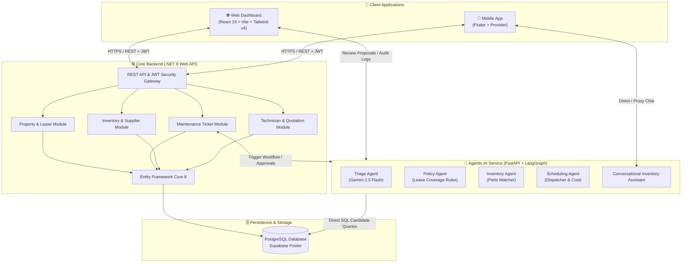
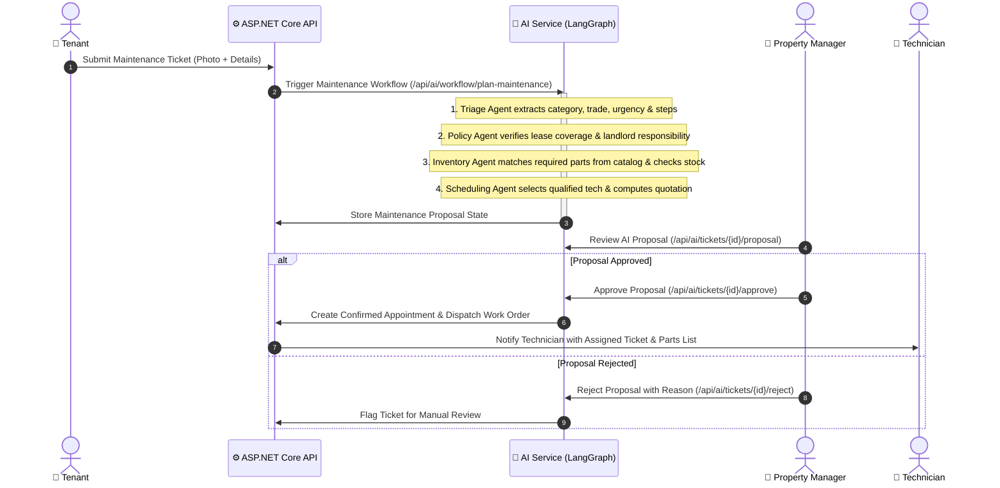

# SmartSpace 🏢⚡

<div align="center">

[](https://dotnet.microsoft.com/)
[](https://react.dev/)
[](https://tailwindcss.com/)
[](https://flutter.dev/)
[](https://fastapi.tiangolo.com/)
[](https://langchain-ai.github.io/langgraph/)
[](https://aistudio.google.com/)
[](https://www.postgresql.org/)
[](https://github.com/features/actions)

<p align="center">
  <strong>Next-Generation Property & Maintenance Management Platform Powered by Multi-Agent AI</strong>
</p>

<p align="center">
  SmartSpace unifies tenants, property managers, inventory officers, and field technicians into a streamlined, cross-platform ecosystem. Featuring an autonomous <strong>four-agent AI workflow</strong> that triages maintenance emergencies, verifies lease liabilities, matches warehouse inventory, and schedules qualified technicians with human-in-the-loop governance.
</p>

<p align="center">
  <a href="#-architecture">Architecture</a> •
  <a href="#-core-modules">Core Modules</a> •
  <a href="#-agentic-ai-workflow">Agentic AI Workflow</a> •
  <a href="#-tech-stack">Tech Stack</a> •
  <a href="#-getting-started">Getting Started</a> •
  <a href="#-testing--quality-assurance">Testing</a> •
  <a href="#-git-workflow--conventions">Git Workflow</a>
</p>

</div>

---

## 🌟 Key Highlights

- **🤖 Autonomous Multi-Agent Triage:** LangChain and LangGraph pipeline coordinating specialized agents to extract issue severity, verify lease agreements, check real-time warehouse stock, and compute repair estimates.
- **🛡️ Human-in-the-Loop Governance:** Property managers review, modify, approve, or reject AI-generated repair plans before dispatching work orders. Every agent step generates audit logs with latency, token usage, and confidence tracking.
- **💬 Conversational Inventory Assistant:** Natural language AI chat module capable of inspecting inventory stock, tracking low-stock thresholds, and interactively onboarding new suppliers and parts.
- **📱 Cross-Platform Accessibility:** Modern, ultra-responsive React 19 web application paired with a native Flutter mobile app featuring camera-based ticket attachments and offline-ready QR code scanning for parts lookups.
- **🔐 Enterprise Security & RBAC:** End-to-end JWT role-based access control protecting sensitive operations across Tenants, Property Managers, Technicians, and Inventory Officers.

---

## 🏗️ Architecture



---

## 🧩 Core Modules

| Module | Description | Primary Users |
|---|---|---|
| **🏢 Property & Lease Management** | Manages buildings, units, tenant leases, deposit terms, and tenant occupancy histories. | Property Managers, Landlords |
| **🎫 Maintenance Requests** | Tenant ticket submission with photo uploads, category tagging, status progression, and emergency priority handling. | Tenants, Property Managers |
| **📦 Inventory & Supplier Management** | Warehouse parts catalog, stock level alerts, supplier directories, and QR code generation/scanning. | Inventory Officers, Technicians |
| **🛠️ Technician Scheduling & Quotations** | Qualified technician profiles, trade specializations, calendar availability, and automated repair cost estimates. | Technicians, Property Managers |
| **🤖 Multi-Agent AI Maintenance Pipeline** | Automated ticket triage, lease liability evaluation, replacement part identification, and automated proposal compilation. | Automated Pipeline, Property Managers |
| **💬 Conversational AI Assistant** | Real-time conversational interface for fast inventory lookups, restock inquiries, and draft record generation. | Inventory Managers, Technicians |

---

## 🤖 Agentic AI Workflow

SmartSpace implements a stateful multi-agent system powered by **LangGraph** and **Google Gemini 2.5 Flash**. When a maintenance ticket is submitted, the workflow runs sequentially with validation guardrails:



### The 4 Autonomous Agents

1. **Triage Agent (`agents/triage.py`):**
   - Analyzes title and issue description.
   - Categorizes trade requirements (`Plumbing`, `Electrical`, `HVAC`, `Carpentry`, `General`).
   - Assesses urgency score (`Low`, `Medium`, `High`, `Emergency`) and synthesizes a step-by-step resolution plan.
2. **Policy Agent (`agents/policy.py`):**
   - Cross-checks tenant lease agreement terms and standard maintenance policy (`standard-maintenance-policy.v1.json`).
   - Flags exclusions (e.g., cosmetic wear, tenant-caused damage) and assigns financial responsibility (`Landlord`, `Tenant`, `Shared`).
3. **Inventory Agent (`agents/inventory.py`):**
   - Matches planned steps against active warehouse inventory items and compatible parts.
   - Evaluates stock availability, identifies potential backorders, and calculates material expenditures.
4. **Scheduling Agent (`agents/scheduling.py`):**
   - Discovers available technicians with matching trade certifications.
   - Estimates labor hours, calculates total job quotation (Labor + Materials), and reserves optimal dispatch time slots.

---

## 💻 Tech Stack

### Frontend & Mobile
- **Web Frontend:** React 19, Vite 8, Tailwind CSS v4, Zustand, React Router v7, Lucide Icons, HTML5-QRCode, Vitest, Oxlint
- **Mobile Application:** Flutter 3.x (Dart), Provider state management, QR Scanner, Image Picker, HTTP Client

### Backend & Microservices
- **Core API:** ASP.NET Core 8 Web API (C#), Entity Framework Core 8, Npgsql
- **Authentication:** JWT Bearer Authentication with role-based policies
- **Documentation:** Swagger / OpenAPI UI
- **AI Microservice:** Python 3.11+, FastAPI, LangChain, LangGraph, Pydantic v2, Google Gemini API (`gemini-2.5-flash`)

### Database & Infrastructure
- **Database:** PostgreSQL 15+ (hosted on Supabase / local Docker)
- **Containerization:** Multi-stage production `Dockerfile` for ASP.NET Core API
- **Continuous Integration:** GitHub Actions (.NET 8, React/Node.js, Flutter)

---

## 📁 Repository Structure

```text
SmartSpace/
├── .github/
│   └── workflows/
│       └── main.yml             # GitHub Actions CI matrix (Backend, Web, Mobile)
├── backend/
│   ├── SmartSpace.API/          # ASP.NET Core 8 Web API
│   │   ├── Configuration/       # JWT & application settings
│   │   ├── Controllers/         # REST API endpoints (Auth, Users, Property, Tickets, Inventory, Scheduling)
│   │   ├── Data/                # EF Core DbContext & model configurations
│   │   ├── DTOs/                # Strongly-typed request/response transfer objects
│   │   ├── Migrations/          # EF Core database migrations
│   │   ├── Models/              # Domain entities
│   │   ├── Services/            # Business logic layer
│   │   ├── Dockerfile           # Multi-stage production Dockerfile
│   │   └── Program.cs           # Application entrypoint & middleware pipeline
│   └── SmartSpace.Tests/        # xUnit automated security & integration tests
├── frontend-web/                # React 19 + Vite + Tailwind CSS v4 Web App
│   ├── src/
│   │   ├── components/          # Reusable UI components & modals
│   │   ├── pages/               # Role-based dashboards & workflow views
│   │   ├── store/               # Zustand state stores (auth, alerts, tickets)
│   │   └── services/            # API integration clients
│   ├── package.json
│   └── vite.config.js
├── mobile-app/
│   └── smartspace_mobile/       # Flutter cross-platform mobile application
│       ├── lib/
│       │   ├── models/          # Dart data models
│       │   ├── providers/       # State management providers
│       │   ├── screens/         # Mobile screens (Dashboards, Tickets, Catalog, QR Scanner)
│       │   ├── services/        # Backend & AI API service adapters
│       │   └── widgets/         # Reusable Flutter UI widgets
│       └── pubspec.yaml
└── ai-service/                  # Python FastAPI Agentic AI Microservice
    ├── agents/                  # Triage, Policy, Inventory, and Scheduling agents
    ├── core/                    # Config, database connection, security, error handling
    ├── graph/                   # LangGraph maintenance workflow state machine
    ├── policies/                # JSON policy definitions
    ├── routers/                 # FastAPI routes (/api/ai, /api/inventory-assistant)
    ├── schemas/                 # Pydantic v2 schemas and validation contracts
    ├── services/                # Workflow runner, review manager, AI assistant service
    ├── tests/                   # Pytest suite for agents and approval workflows
    ├── requirements.txt
    └── main.py                  # FastAPI service entrypoint
```

---

## 🚀 Getting Started

### Prerequisites

Ensure you have the following installed on your machine:
- [.NET 8.0 SDK](https://dotnet.microsoft.com/download/dotnet/8.0)
- [Node.js (v20+ recommended)](https://nodejs.org/) & `npm`
- [Python 3.11+](https://www.python.org/downloads/)
- [Flutter SDK (3.x)](https://docs.flutter.dev/get-started/install)
- [PostgreSQL 15+](https://www.postgresql.org/) or a free [Supabase](https://supabase.com/) account
- A free [Google AI Studio](https://aistudio.google.com/) Gemini API key

---

### 1. Database Setup

Create a PostgreSQL database (e.g. `smartspace_db`) or spin up a Supabase project.

> [!IMPORTANT]
> When using Supabase on IPv4 networks, always use the **IPv4 connection pooler** hostname (`aws-0-<region>.pooler.supabase.com` on port `5432` with username `postgres.<project-ref>`) instead of direct hostname to prevent DNS and IPv6 resolution errors.

---

### 2. Backend API Setup (.NET 8)

1. Open your terminal and navigate to the backend directory:
   ```bash
   cd backend/SmartSpace.API
   ```

2. Initialize user-secrets and configure your database connection string and JWT secret:
   ```bash
   dotnet user-secrets init
   dotnet user-secrets set "ConnectionStrings:DefaultConnection" "Host=your-host;Port=5432;Database=smartspace_db;Username=postgres;Password=your_password;SSL Mode=Prefer"
   dotnet user-secrets set "JwtSettings:SecretKey" "SmartSpaceSuperSecretKeyForJWTTokenSigning2026!"
   ```

3. Apply database migrations:
   ```bash
   dotnet ef database update
   ```

4. Run the API:
   ```bash
   dotnet run
   ```
   - 🌐 API Address: `http://localhost:5030`
   - 📑 Swagger Documentation: `http://localhost:5030/swagger`

---

### 3. Agentic AI Service Setup (Python FastAPI)

1. Open a new terminal and navigate to the `ai-service` directory:
   ```bash
   cd ai-service
   ```

2. Create and activate a Python virtual environment:
   ```bash
   # Windows
   python -m venv venv
   venv\Scripts\activate

   # macOS / Linux
   python3 -m venv venv
   source venv/bin/activate
   ```

3. Install dependencies:
   ```bash
   pip install -r requirements.txt
   ```

4. Configure environment variables by copying `.env.example`:
   ```bash
   cp .env.example .env
   ```
   Open `.env` and fill in your:
   - `DATABASE_URL` (Matches your PostgreSQL connection string)
   - `INVENTORY_AGENT_API_KEY`, `TRIAGE_AGENT_API_KEY`, `POLICY_AGENT_API_KEY`, `SCHEDULING_AGENT_API_KEY` (Your Gemini API Key)

5. Start the AI service with auto-reload:
   ```bash
   uvicorn main:app --reload --port 8000
   ```
   - 🌐 Service Health: `http://localhost:8000/health`
   - 📑 OpenAPI Interactive Docs: `http://localhost:8000/docs`

---

### 4. Web Frontend Setup (React 19 + Vite)

1. Navigate to the web frontend directory:
   ```bash
   cd frontend-web
   ```

2. Configure environment variables (defaults connect to `localhost:5030` and `localhost:8000`):
   ```bash
   cp .env.example .env
   ```

3. Install packages and start the Vite development server:
   ```bash
   npm install
   npm run dev
   ```
   - 🌐 Web Dashboard: `http://localhost:5173`

---

### 5. Mobile App Setup (Flutter)

1. Navigate to the mobile app directory:
   ```bash
   cd mobile-app/smartspace_mobile
   ```

2. Fetch Flutter packages:
   ```bash
   flutter pub get
   ```

3. Run the app on your connected device or emulator:
   ```bash
   # Android Emulator (automatically maps API to 10.0.2.2:5030)
   flutter run

   # Or specify custom backend target via dart-define
   flutter run --dart-define=API_URL=http://<your-lan-ip>:5030/api
   ```

---

## 🧪 Testing & Quality Assurance

SmartSpace features automated test suites across every tier of the stack:

| Component | Test Framework | Command |
|---|---|---|
| **Backend API** | xUnit (.NET 8) | `dotnet test backend/SmartSpace.Tests` |
| **AI Service** | Pytest (Python) | `cd ai-service && pytest` |
| **Web Frontend** | Vitest & Oxlint | `cd frontend-web && npm run test && npm run lint` |
| **Mobile App** | Flutter Analyzer | `cd mobile-app/smartspace_mobile && flutter analyze` |

---

## 🔄 CI/CD Automation

Continuous Integration is orchestrated with **GitHub Actions** (`.github/workflows/main.yml`). On every push and pull request against `main` or `dev`:
- 🔨 **Backend Job:** Installs .NET 8, restores packages, compiles binaries in Release mode, and runs automated unit & security tests.
- 🌐 **Web Frontend Job:** Sets up Node.js 20, verifies clean dependency installations, and validates production builds.
- 📱 **Mobile App Job:** Configures Java 17 & Flutter SDK, fetches dependencies, and executes static analysis without warnings.

---

## 🌿 Git Workflow & Conventions

To maintain codebase stability, direct commits to `main` are restricted. All team members follow feature branching and PR reviews:

### Branch Naming Patterns

| Component / Scope | Pattern | Example |
|---|---|---|
| **Property & Lease Management** | `feature/property-*` | `feature/property-lease-expiry-alerts` |
| **Maintenance Request Management** | `feature/maintenance-*` | `feature/maintenance-photo-upload` |
| **Inventory & Supplier Management** | `feature/inventory-*` | `feature/inventory-qr-lookup` |
| **Technician Scheduling & Quotations** | `feature/scheduling-*` | `feature/scheduling-calendar-view` |
| **AI Workflows & Assistant** | `feature/ai-*` | `feature/ai-gemini-streaming` |
| **Bug Fixes** | `fix/*` | `fix/auth-token-expiration` |

### Commit Message Standard
Follow [Conventional Commits](https://www.conventionalcommits.org/):
- `feat: add AI audit history view to property manager portal`
- `fix: resolve IPv4 database connection pooler timeouts`
- `docs: update setup documentation and architectural diagrams`
- `test: add idempotency unit tests for proposal approvals`

---

## 👥 Roles & Permissions Matrix

| Feature / Action | Admin | Property Manager | Tenant | Technician | Inventory Officer |
|---|:---:|:---:|:---:|:---:|:---:|
| User & Role Management | ✅ | ❌ | ❌ | ❌ | ❌ |
| Create Properties & Leases | ✅ | ✅ | ❌ | ❌ | ❌ |
| Submit Maintenance Ticket | ✅ | ✅ | ✅ | ❌ | ❌ |
| Review & Approve AI Proposals | ✅ | ✅ | ❌ | ❌ | ❌ |
| Update Assigned Ticket Status | ✅ | ✅ | ❌ | ✅ | ❌ |
| Manage Inventory & Parts | ✅ | ✅ | ❌ | Read | ✅ |
| Conversational Inventory AI | ✅ | ✅ | ❌ | Read | ✅ |

---

## 📄 Academic Attribution & License

Developed as part of **SE3090: Software Engineering Frameworks** at the **Sri Lanka Institute of Information Technology (SLIIT)**.

Licensed under the [MIT License](LICENSE).
